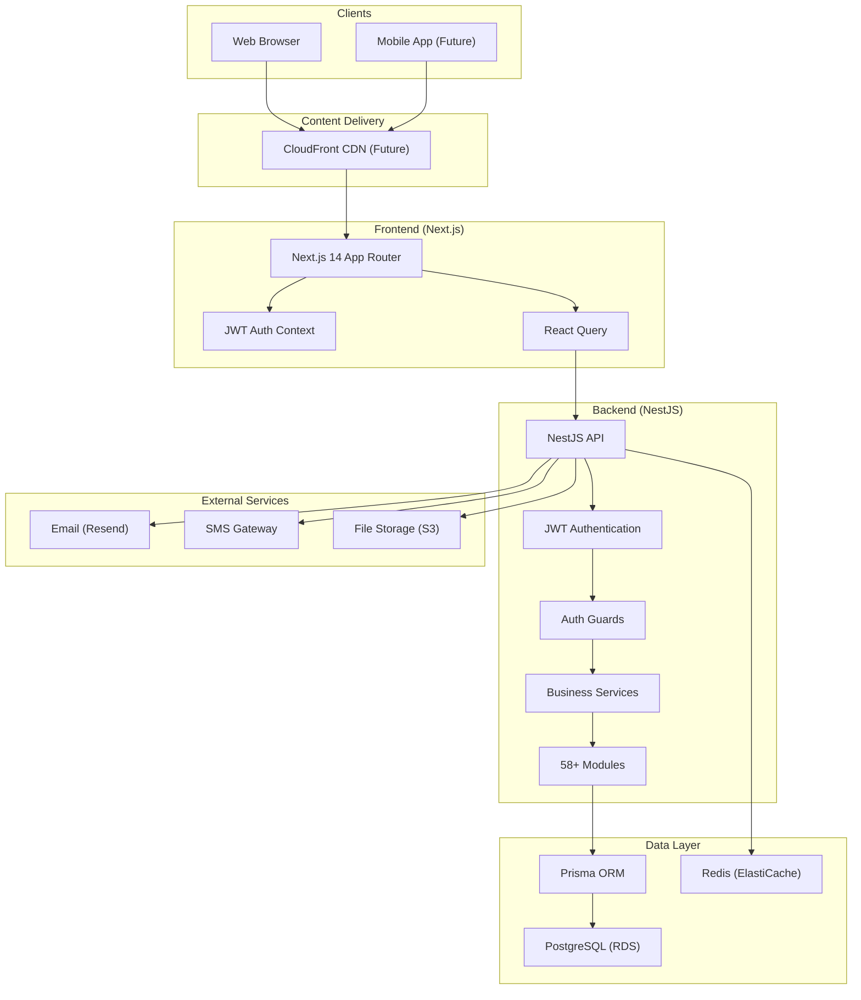
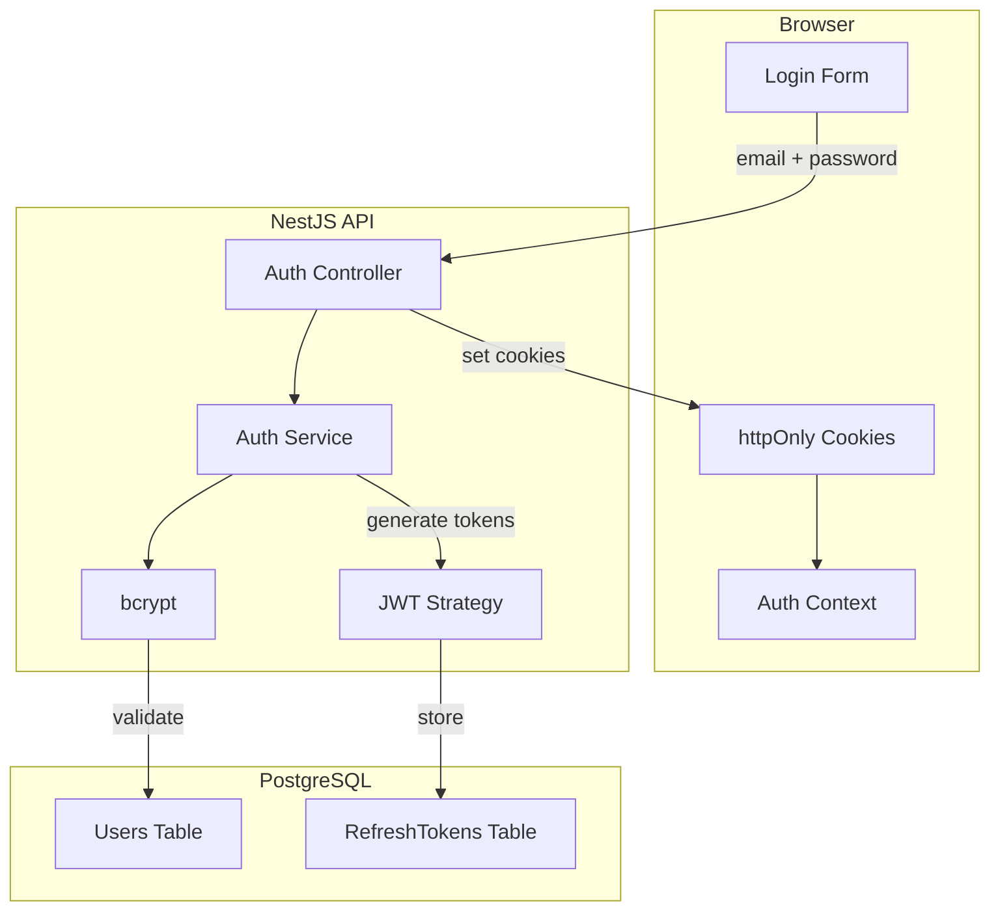
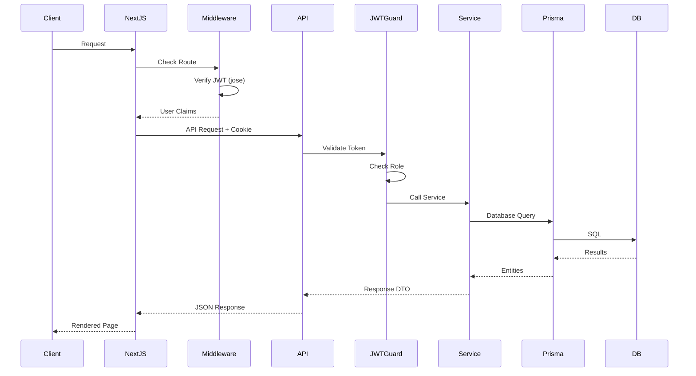
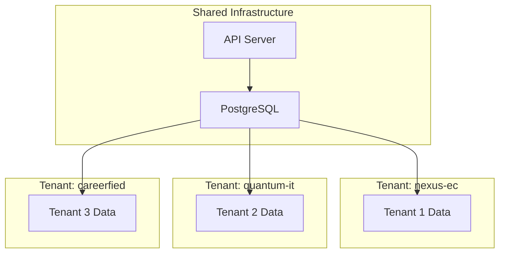
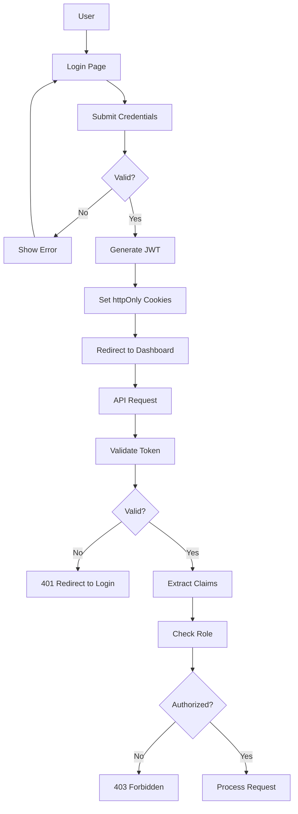
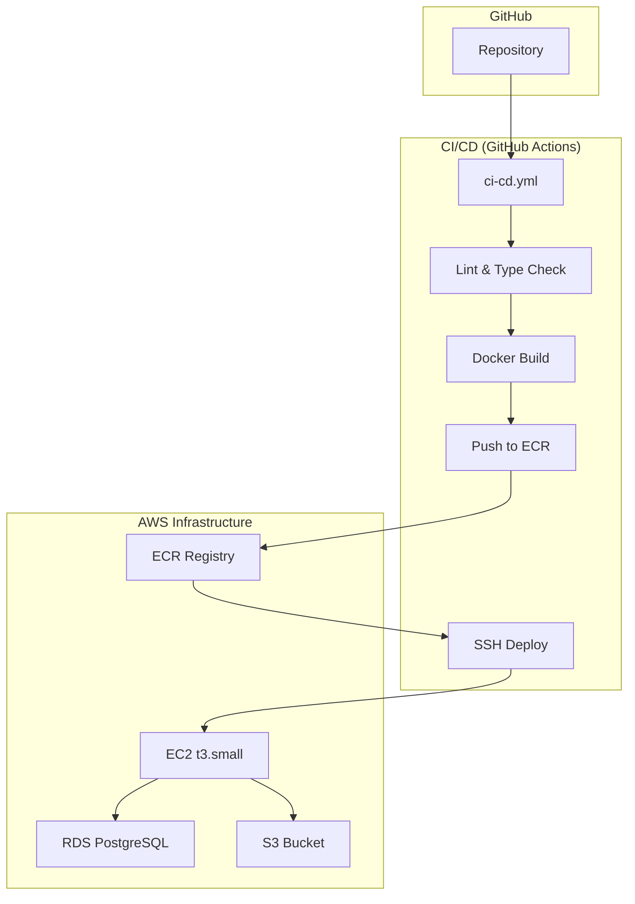

# System Architecture

This document provides an overview of the EduNexus system architecture, including high-level design, component interactions, and deployment topology.

**Last Updated:** January 22, 2026

## High-Level Architecture



## Technology Stack

### Frontend
| Technology | Purpose | Version |
|------------|---------|---------|
| Next.js | React framework with App Router | 14.x |
| React | UI library | 18.x |
| TypeScript | Type-safe JavaScript | 5.x |
| TailwindCSS | Utility-first CSS | 3.x |
| shadcn/ui | Component library | Latest |
| React Query | Server state management | 5.x |
| jose | JWT verification | Latest |
| Lucide React | Icon library | Latest |
| Recharts | Chart library | 2.x |

### Backend
| Technology | Purpose | Version |
|------------|---------|---------|
| NestJS | Node.js framework | 10.x |
| TypeScript | Type-safe JavaScript | 5.x |
| Prisma | ORM | 5.x |
| PostgreSQL | Primary database | 15.x |
| @nestjs/jwt | JWT token handling | Latest |
| Passport | Authentication middleware | Latest |
| bcrypt | Password hashing | Latest |
| Class Validator | DTO validation | Latest |

### Infrastructure (AWS)
| Service | Purpose |
|---------|---------|
| EC2 (t3.small) | API + Web hosting |
| RDS (db.t3.micro) | PostgreSQL database |
| S3 | File storage (documents, photos) |
| ElastiCache | Redis caching (future) |
| CloudWatch | Monitoring & alerts |

### DevOps
| Technology | Purpose |
|------------|---------|
| pnpm | Package manager |
| Turborepo | Monorepo build |
| Docker | Containerization |
| Docker Compose | Local orchestration |
| GitHub Actions | CI/CD |

## Authentication Architecture

### JWT-Based Authentication (Replaced Clerk - January 2026)



### Authentication Endpoints

| Endpoint | Method | Description |
|----------|--------|-------------|
| `/auth/register` | POST | Create user with email/password |
| `/auth/login` | POST | Validate credentials, return JWT |
| `/auth/refresh` | POST | Refresh access token |
| `/auth/logout` | POST | Revoke refresh token |
| `/auth/me` | GET | Get current user from JWT |
| `/auth/change-password` | POST | Update password |

### JWT Token Structure

```json
{
  "sub": "user_abc123",
  "email": "student@college.edu",
  "name": "John Doe",
  "role": "student",
  "tenantId": "tenant_xyz",
  "iat": 1704067200,
  "exp": 1704672000
}
```

### Token Security
- **Access Token**: 15 minutes expiry, stored in httpOnly cookie
- **Refresh Token**: 7 days expiry, stored in httpOnly cookie
- **Password Hashing**: bcrypt with 12 rounds
- **Token Rotation**: New refresh token on each refresh

## Module Architecture

```mermaid
flowchart LR
    subgraph CoreModules["Core Modules"]
        Auth["Auth Module"]
        Users["Users Module"]
        Tenants["Tenants Module"]
    end

    subgraph AcademicModules["Academic Modules"]
        Departments["Departments"]
        Courses["Courses"]
        Subjects["Subjects"]
        Attendance["Attendance"]
        Exams["Exams"]
        Results["Results"]
    end

    subgraph StudentModules["Student Modules"]
        Students["Students"]
        Fees["Fees"]
        SGI["Student Growth Index"]
        CRI["Career Readiness"]
        Goals["Goals"]
        Journey["Journey"]
    end

    subgraph StaffModules["Staff Modules"]
        Staff["Staff"]
        Teachers["Teachers"]
        LabAssistants["Lab Assistants"]
    end

    subgraph AdminModules["Admin Modules"]
        Records["Records"]
        Certificates["Certificates"]
        Library["Library"]
        Hostel["Hostel"]
        Transport["Transport"]
    end

    subgraph EnrollmentModules["Enrollment Modules"]
        StudentEnrollment["Student Enrollment"]
        OnboardingFlow["Onboarding Flow"]
        ApprovalWorkflow["Approval Workflow"]
    end

    subgraph CommunityModules["Community Modules"]
        Parents["Parents"]
        Alumni["Alumni"]
        Mentorship["Mentorship"]
    end

    subgraph SupportModules["Support Modules"]
        Feedback["360 Feedback"]
        Notifications["Notifications"]
        Communications["Communications"]
        Events["Events"]
    end

    CoreModules --> AcademicModules
    CoreModules --> StudentModules
    CoreModules --> StaffModules
    CoreModules --> EnrollmentModules
    AcademicModules --> AdminModules
    StudentModules --> CommunityModules
    StaffModules --> SupportModules
    EnrollmentModules --> StudentModules
```



## Database Schema Overview

The database contains 130+ models organized into functional groups:

### Core Models
- `Tenant` - Multi-tenant organization
- `User` - All user accounts with passwordHash
- `UserProfile` - Extended user information
- `RefreshToken` - JWT refresh token storage

### Academic Models
- `Department`, `Course`, `Subject`
- `Exam`, `ExamResult`
- `StudentAttendance`, `StudentFee`

### Enrollment & Onboarding Models
- `StudentEnrollment` - Enrollment workflow state and student data
- `EnrollmentStatus` - Workflow states (INITIATED → COMPLETED)

### Growth & Career Models
- `StudentGrowthIndex` - SGI scores
- `CareerReadinessIndex` - CRI scores
- `StudentGoal`, `AiGuidance`
- `JourneyMilestone`, `SemesterSnapshot`

### Feedback Models
- `FeedbackCycle`, `FeedbackEntry`
- `FeedbackSummary`

### Campus Services
- `LibraryBook`, `BookIssue`, `LibraryCard`
- `HostelBlock`, `HostelRoom`, `HostelAllocation`
- `TransportRoute`, `TransportPass`
- `CertificateType`, `CertificateRequest`

### Alumni Models
- `AlumniProfile`, `AlumniEmployment`
- `AlumniMentorship`, `AlumniEvent`

## API Architecture

### Route Structure

```
/api/v1
├── /auth                    # JWT Authentication
│   ├── POST /register
│   ├── POST /login
│   ├── POST /refresh
│   ├── POST /logout
│   └── GET /me
├── /users                   # User management
├── /tenants                 # Tenant operations
│
├── /principal-dashboard     # Principal APIs
├── /hod-dashboard          # HOD APIs
├── /admin-*                # Admin APIs
├── /teacher-*              # Teacher APIs
├── /lab-assistant          # Lab Assistant APIs
├── /student-*              # Student APIs
├── /parent-*               # Parent APIs
├── /alumni                 # Alumni APIs
│
├── /student-enrollment     # Enrollment & Onboarding
│   ├── POST /initiate      # Admin initiates enrollment
│   ├── POST /:id/send-invitation  # Send email invite
│   ├── GET /verify/:token  # Verify token (public)
│   ├── POST /signup/:token # Student completes signup
│   ├── PATCH /profile/:token # Update profile
│   ├── POST /submit/:token # Submit for review
│   ├── POST /:id/admin-review # Admin approves
│   ├── GET /pending-approval # HOD/Principal list
│   └── POST /:id/approve   # Final approval
│
├── /departments            # Academic
├── /courses
├── /subjects
├── /exams
│
├── /student-indices        # SGI/CRI
├── /student-journey        # Journey tracking
├── /student-goals          # Goal management
├── /feedback               # 360 Feedback
│
├── /library               # Library services
├── /hostel                # Hostel management
├── /transport             # Transport services
├── /certificates          # Certificate requests
│
├── /notifications         # Notifications
├── /communications        # Bulk communications
└── /events                # Event management
```

### Request Flow



## Multi-Tenancy Architecture

### Tenant Isolation



Every table has a `tenantId` column ensuring data isolation at the row level.

## Security Architecture

### Authentication Flow



### Authorization Layers

1. **Route-level**: Middleware checks JWT for route access
2. **Endpoint-level**: Guards validate specific roles/permissions
3. **Data-level**: Tenant ID filtering on all queries

### User Roles (9 roles)

| Role | Dashboard | Description |
|------|-----------|-------------|
| platform_owner | /platform | Super admin, all tenants |
| principal | /principal | College principal |
| hod | /hod | Head of Department |
| admin_staff | /admin | Administrative staff |
| teacher | /teacher | Faculty members |
| lab_assistant | /lab-assistant | Lab staff |
| student | /student | Students |
| parent | /parent | Student parents |
| alumni | /alumni | Graduated students |

## Deployment Architecture

### Current Infrastructure (AWS EC2)



### Docker Compose Stack

```yaml
services:
  api:
    image: edunexus-api
    ports: ["3001:3001"]
    environment:
      - DATABASE_URL
      - JWT_SECRET
      - JWT_ACCESS_EXPIRY=15m
      - JWT_REFRESH_EXPIRY=7d

  web:
    image: edunexus-web
    ports: ["3000:3000"]
    environment:
      - NEXT_PUBLIC_API_URL

  postgres:
    image: postgres:15
    volumes: [postgres_data:/var/lib/postgresql/data]

  redis:
    image: redis:7-alpine
    volumes: [redis_data:/data]
```

## Performance Considerations

### Frontend Optimization
- Next.js App Router with React Server Components
- Automatic code splitting
- Image optimization via next/image
- Static page generation where possible

### Backend Optimization
- Connection pooling with Prisma
- Pagination on all list endpoints
- Selective field loading
- Index optimization on frequently queried columns

### Caching Strategy
- Redis for session data (planned)
- Query result caching
- CDN for static assets (planned)

## Monitoring & Observability

| Aspect | Tool | Status |
|--------|------|--------|
| Error Tracking | Sentry | Planned |
| Metrics | CloudWatch | Planned |
| Logging | CloudWatch Logs | Planned |
| Uptime | CloudWatch Alarms | Planned |

## Cost Optimization

| Item | Monthly Cost |
|------|-------------|
| EC2 t3.small | ~$15 |
| RDS db.t3.micro | ~$12.50 |
| S3 + Data Transfer | ~$5 |
| **Total** | **~$32/month** |

*Note: Removed Clerk ($25+/month) by migrating to JWT auth in January 2026*

## Scaling Considerations

1. **Horizontal Scaling**: Stateless API design allows multiple instances
2. **Database Scaling**: Read replicas for reporting queries
3. **Tenant Sharding**: Future consideration for very large tenants
4. **Microservices**: Potential split of heavy modules (notifications, reports)

---

## Related Documents

- [Multi-Tenancy](./MULTI_TENANCY.md)
- [Data Flow Diagrams](./DATA_FLOW_DIAGRAMS.md)
- [API Documentation](./API_DOCUMENTATION.md)
- [Deployment Guide](../deployment/DEPLOYMENT_GUIDE.md)
