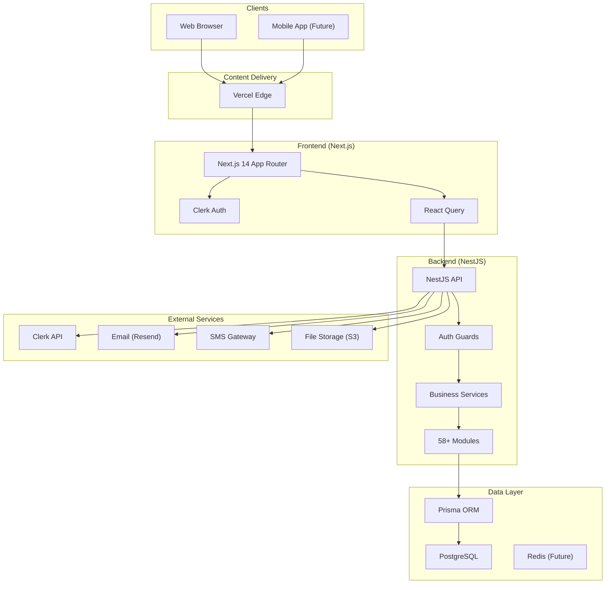
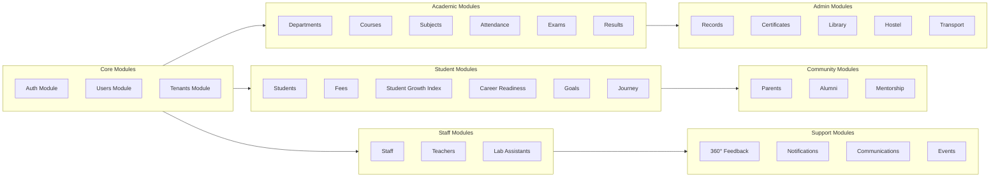
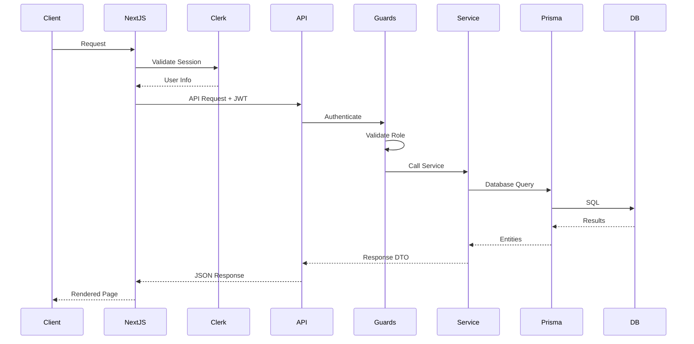
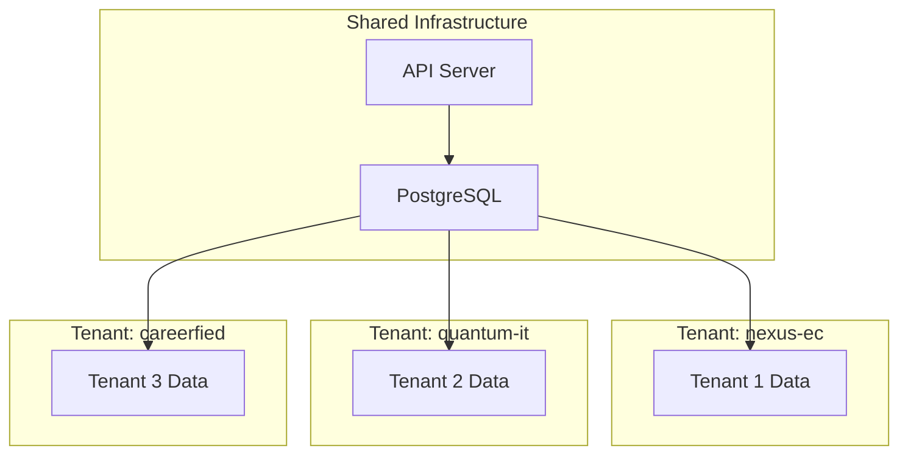
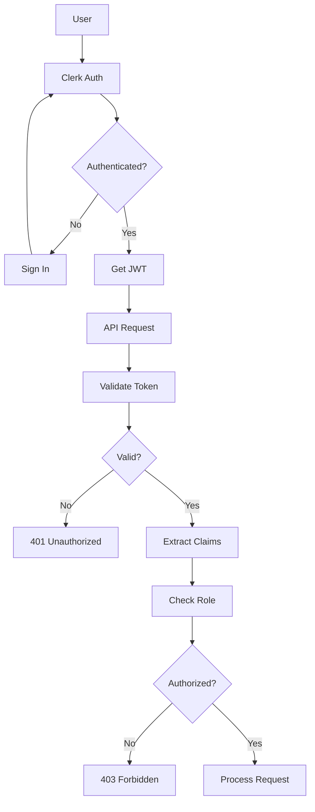
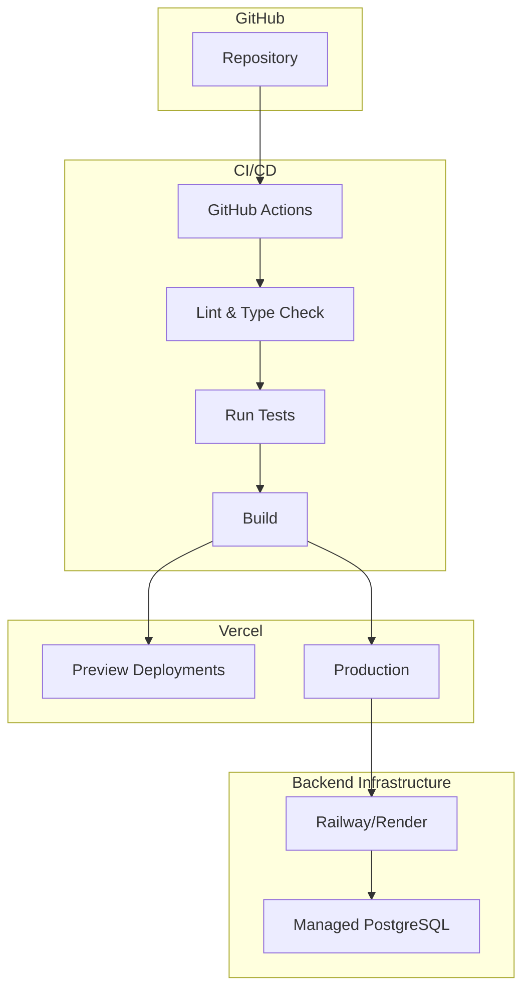

# System Architecture

This document provides an overview of the EduNexus system architecture, including high-level design, component interactions, and deployment topology.

## High-Level Architecture



## Technology Stack

### Frontend
| Technology | Purpose | Version |
|------------|---------|---------|
| Next.js | React framework with App Router | 14.x |
| React | UI library | 18.x |
| TypeScript | Type-safe JavaScript | 5.x |
| TailwindCSS | Utility-first CSS | 3.x |
| shadcn/ui | Component library | Latest |
| React Query | Server state management | 5.x |
| Clerk | Authentication | Latest |
| Lucide React | Icon library | Latest |
| Recharts | Chart library | 2.x |

### Backend
| Technology | Purpose | Version |
|------------|---------|---------|
| NestJS | Node.js framework | 10.x |
| TypeScript | Type-safe JavaScript | 5.x |
| Prisma | ORM | 5.x |
| PostgreSQL | Primary database | 15.x |
| Class Validator | DTO validation | Latest |
| Swagger | API documentation | Latest |

### DevOps
| Technology | Purpose |
|------------|---------|
| pnpm | Package manager |
| Turborepo | Monorepo build |
| Vercel | Frontend hosting |
| Docker | Containerization |
| GitHub Actions | CI/CD |

## Module Architecture



## Database Schema Overview

The database contains 130+ models organized into functional groups:

### Core Models
- `Tenant` - Multi-tenant organization
- `User` - All user accounts
- `UserProfile` - Extended user information

### Academic Models
- `Department`, `Course`, `Subject`
- `Exam`, `ExamResult`
- `StudentAttendance`, `StudentFee`

### Growth & Career Models
- `StudentGrowthIndex` - SGI scores
- `CareerReadinessIndex` - CRI scores
- `StudentGoal`, `AiGuidance`
- `JourneyMilestone`, `SemesterSnapshot`

### Feedback Models
- `FeedbackCycle`, `FeedbackEntry`
- `FeedbackSummary`

### Campus Services
- `LibraryBook`, `BookIssue`, `LibraryCard`
- `HostelBlock`, `HostelRoom`, `HostelAllocation`
- `TransportRoute`, `TransportPass`
- `CertificateType`, `CertificateRequest`

### Alumni Models
- `AlumniProfile`, `AlumniEmployment`
- `AlumniMentorship`, `AlumniEvent`

## API Architecture

### Route Structure

```
/api/v1
├── /auth                    # Authentication
├── /users                   # User management
├── /tenants                 # Tenant operations
│
├── /principal-dashboard     # Principal APIs
├── /hod-dashboard          # HOD APIs
├── /admin-*                # Admin APIs
├── /teacher-*              # Teacher APIs
├── /lab-assistant          # Lab Assistant APIs
├── /student-*              # Student APIs
├── /parent-*               # Parent APIs
├── /alumni                 # Alumni APIs
│
├── /departments            # Academic
├── /courses
├── /subjects
├── /exams
│
├── /student-indices        # SGI/CRI
├── /student-journey        # Journey tracking
├── /student-goals          # Goal management
├── /feedback               # 360° Feedback
│
├── /library               # Library services
├── /hostel                # Hostel management
├── /transport             # Transport services
├── /certificates          # Certificate requests
│
├── /notifications         # Notifications
├── /communications        # Bulk communications
└── /events                # Event management
```

### Request Flow



## Multi-Tenancy Architecture

See [Multi-Tenancy](./MULTI_TENANCY.md) for detailed patterns.

### Tenant Isolation



Every table has a `tenantId` column ensuring data isolation at the row level.

## Security Architecture

### Authentication Flow



### Authorization Layers

1. **Route-level**: Middleware checks role for route access
2. **Endpoint-level**: Guards validate specific permissions
3. **Data-level**: Tenant ID filtering on all queries

## Deployment Architecture



## Performance Considerations

### Frontend Optimization
- Next.js App Router with React Server Components
- Automatic code splitting
- Image optimization via next/image
- Static page generation where possible

### Backend Optimization
- Connection pooling with Prisma
- Pagination on all list endpoints
- Selective field loading
- Index optimization on frequently queried columns

### Caching Strategy (Future)
- Redis for session data
- Query result caching
- CDN for static assets

## Monitoring & Observability

| Aspect | Tool |
|--------|------|
| Error Tracking | Sentry |
| Analytics | Vercel Analytics |
| Logging | Console/CloudWatch |
| Uptime | Vercel |

## Scaling Considerations

1. **Horizontal Scaling**: Stateless API design allows multiple instances
2. **Database Scaling**: Read replicas for reporting queries
3. **Tenant Sharding**: Future consideration for very large tenants
4. **Microservices**: Potential split of heavy modules (notifications, reports)

---

## Related Documents

- [Multi-Tenancy](./MULTI_TENANCY.md)
- [Data Flow Diagrams](./DATA_FLOW_DIAGRAMS.md)
- [API Documentation](./API_DOCUMENTATION.md)
