# User Journey Flows

This document outlines the key user journeys for each persona in EduNexus, visualized with Mermaid diagrams.

## Student Journeys

### Journey 1: Daily Check-in Flow

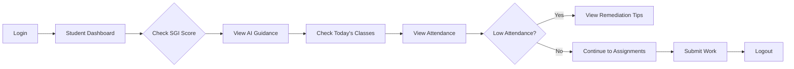

### Journey 2: Career Preparation Flow

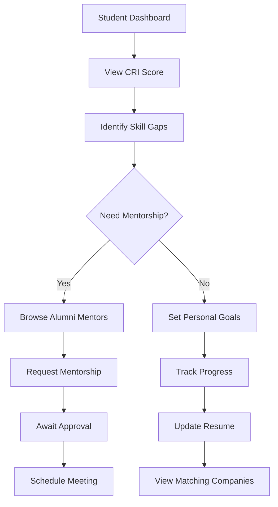

### Journey 3: Fee Payment Flow

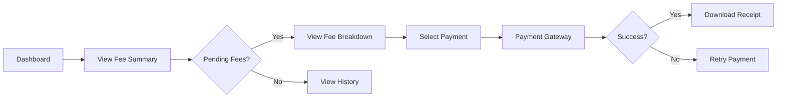

---

## Teacher Journeys

### Journey 4: Daily Attendance Flow

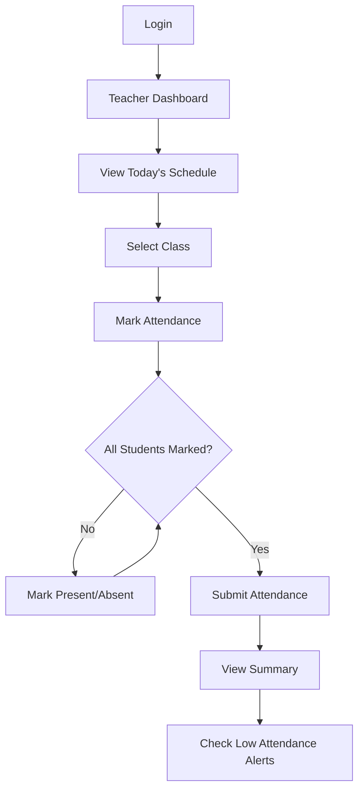

### Journey 5: Assessment & Grading Flow

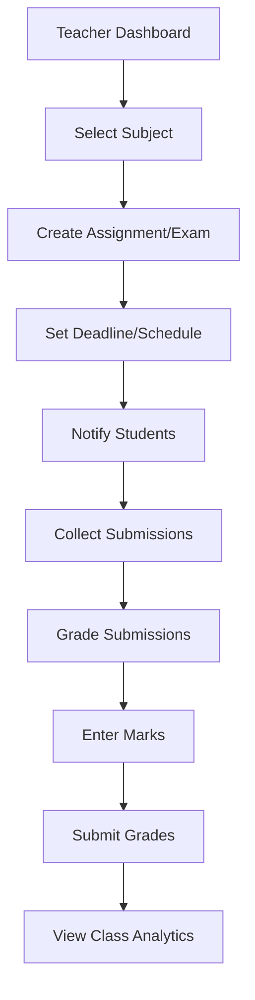

### Journey 6: Student Feedback Flow

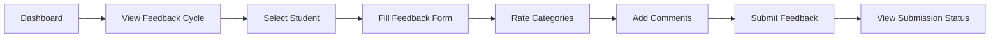

---

## HOD Journeys

### Journey 7: Department Overview Flow

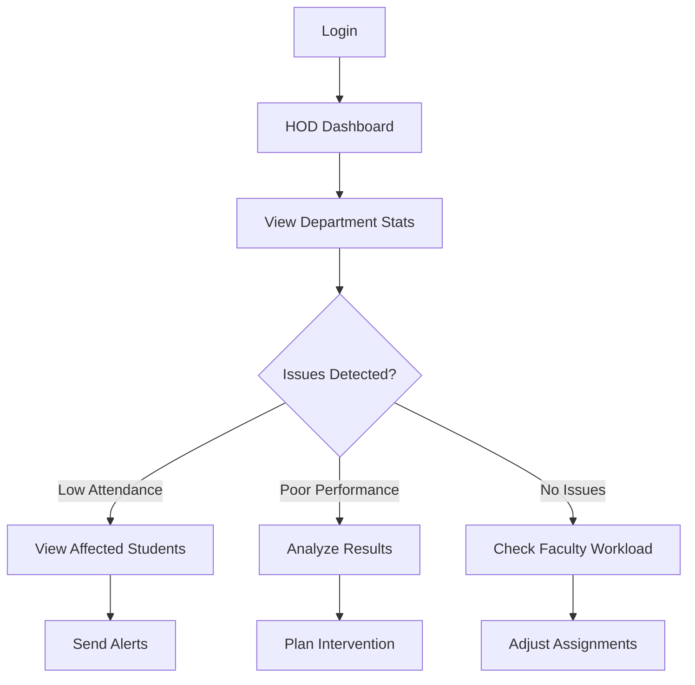

### Journey 8: Faculty Management Flow

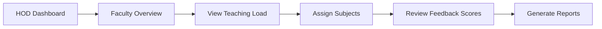

---

## Admin Staff Journeys

### Journey 9: Certificate Processing Flow

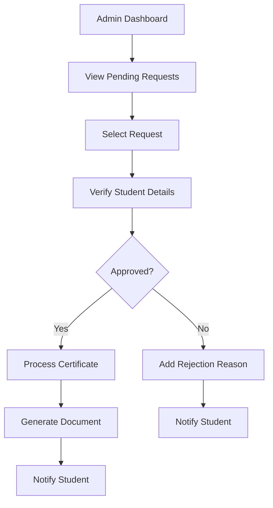

### Journey 10: Fee Management Flow

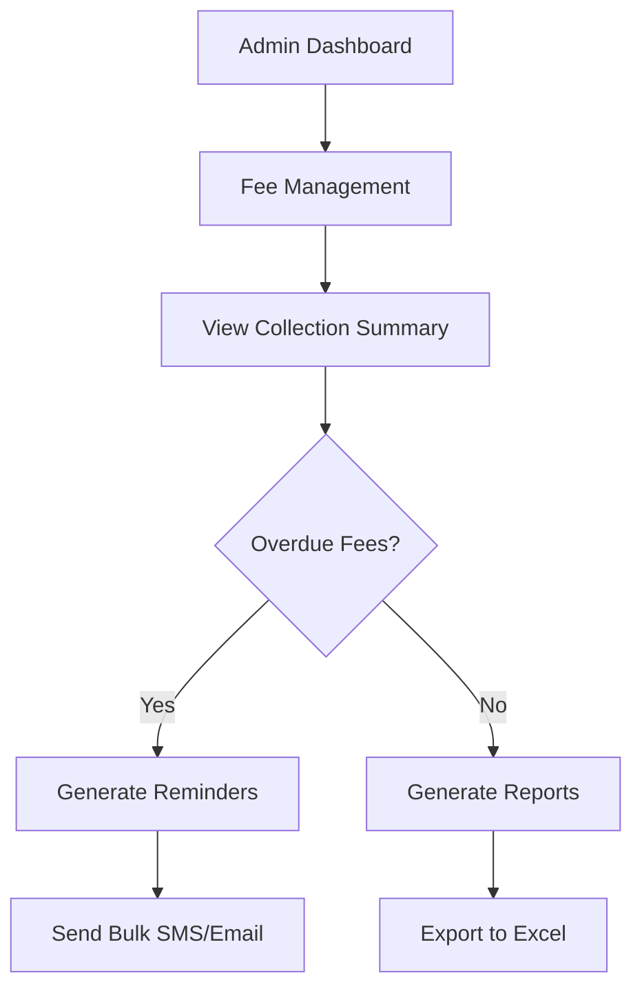

### Journey 11: Hostel Allocation Flow

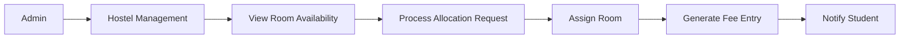

---

## Parent Journeys

### Journey 12: Child Monitoring Flow

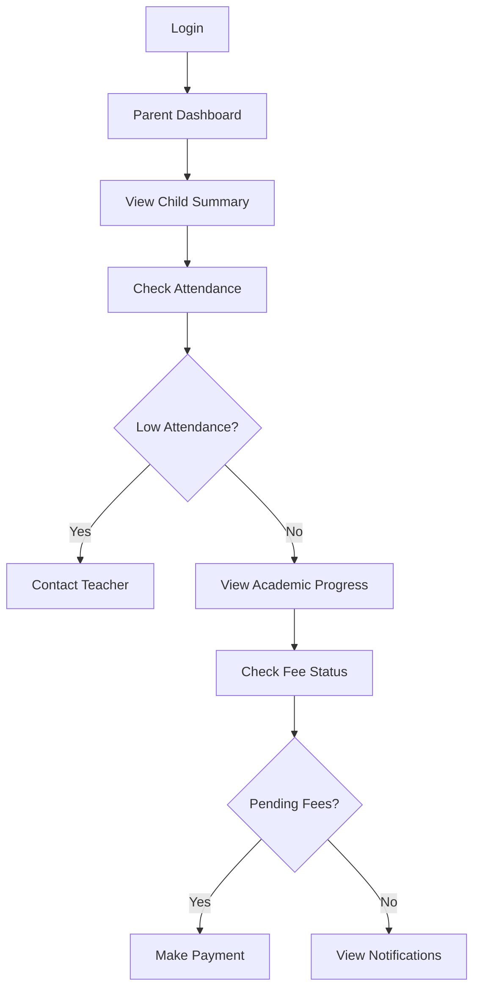

---

## Alumni Journeys

### Journey 13: Mentorship Flow

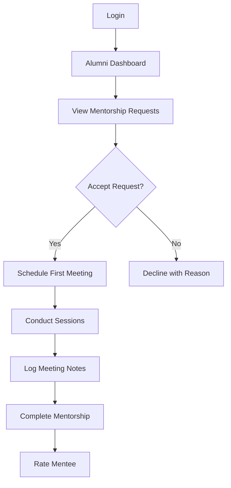

### Journey 14: Event Participation Flow

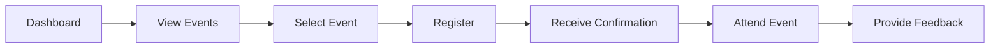

---

## Principal Journeys

### Journey 15: Institution Overview Flow

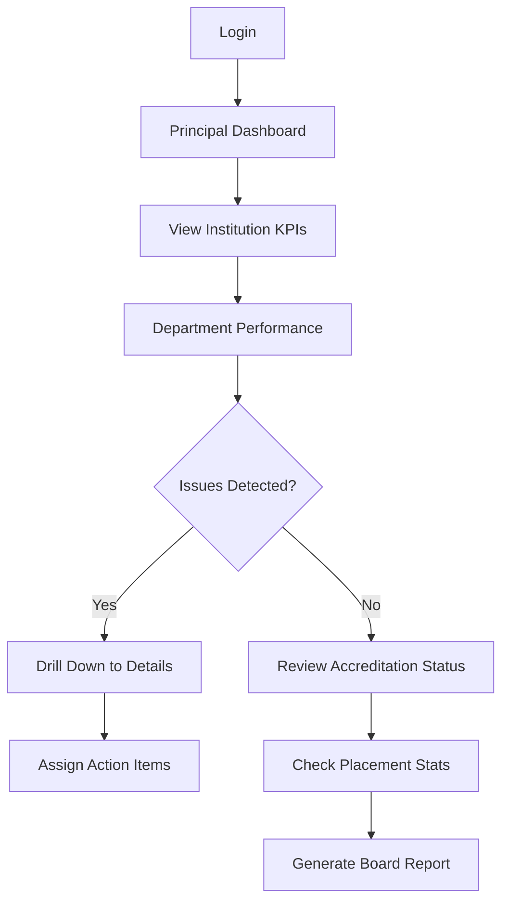

---

## Cross-Persona Interactions

### Feedback Cycle Flow

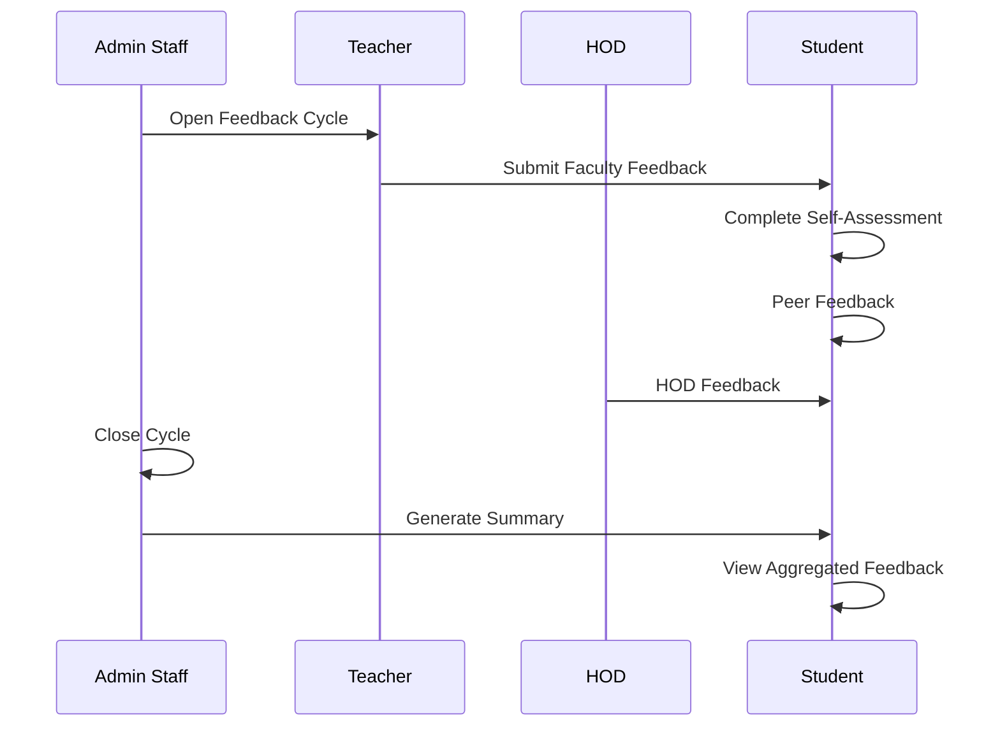

### Placement Drive Flow

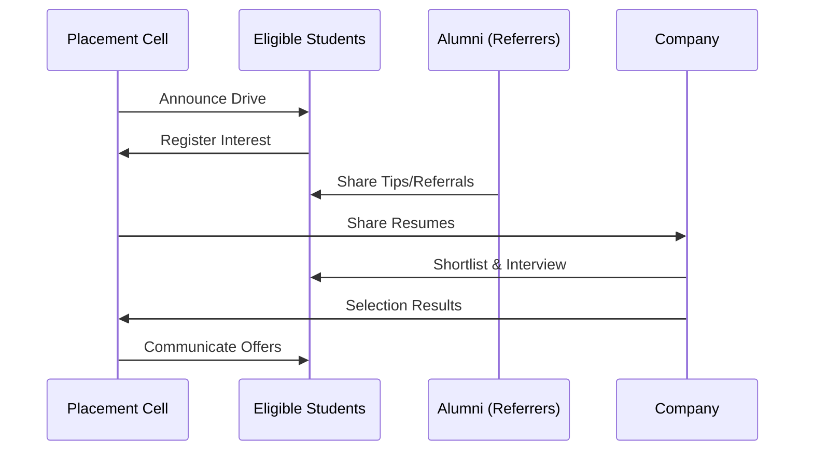

### Disengagement Alert Flow

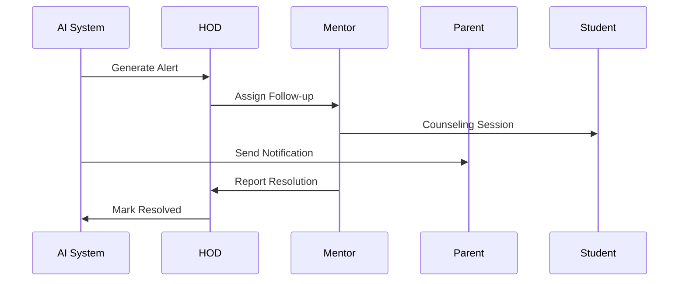

---

## API Touchpoints Summary

| Journey | Key API Endpoints |
|---------|-------------------|
| Student Check-in | `GET /student-indices/dashboard/:id`, `GET /student-journey/my-dashboard` |
| Career Prep | `GET /alumni/mentors`, `POST /alumni/mentorship-request` |
| Fee Payment | `GET /student-fees/:studentId`, `POST /payments/initiate` |
| Attendance | `POST /teacher-attendance`, `GET /teacher-attendance/today` |
| Certificate | `GET /admin-records/certificates`, `PUT /admin-records/certificates/:id` |
| Parent Monitor | `GET /parent-dashboard/:studentId` |
| Alumni Mentor | `GET /alumni/my-mentorships`, `PUT /alumni/mentorship/:id` |
| Principal KPI | `GET /principal-dashboard`, `GET /principal-dashboard/departments` |

---

## Next Steps

For detailed API specifications, see [API Touchpoints](./API_TOUCHPOINTS.md).

For end-to-end test scenarios based on these journeys, see [E2E User Journeys](../testing/E2E_USER_JOURNEYS.md).
